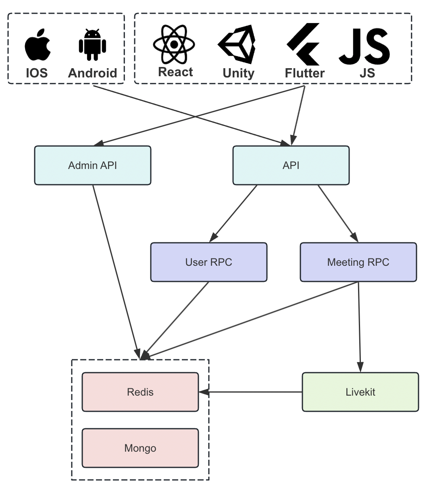
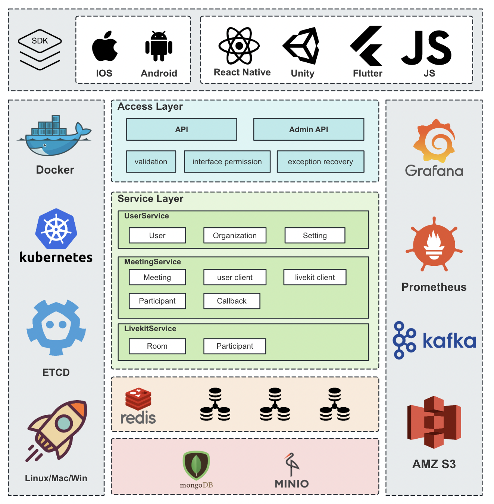

    

## :busts_in_silhouette: 加入我们的社区

## Ⓜ️ 关于 OpenMeeting

OpenMeeting是一个使用Golang开发的开源实时音视频会议系统。OpenMeeting提供了用户管理、会议管理、音视频收发、即刻会议、预约会议、共享屏幕等功能，旨在为用户提供便捷的远程会议体验。它类似于Zoom和腾讯会议，同时支持私有化部署，确保企业和个人用户的数据安全和隐私。

## 🌐 OpenMeetingServer 介绍

+ **OpenMeetingServer** 的特点包括：
    - 立即会议：用户可以随时创建即时会议，邀请他人加入，进行高效的远程沟通。
    - 预约会议：支持预约未来的会议，设置会议时间和参与者，系统会在会议开始前提醒用户。
    - 共享屏幕：用户可以在会议中共享自己的屏幕，便于演示和协作。
    - 高质量音视频：提供高质量的音视频传输，确保会议流畅进行。
    - 多平台支持：支持多种操作系统，包括Windows、macOS、Linux等。
    - 微服务架构：支持集群模式，包括网关(gateway)和多个rpc服务。
    - 多样的部署方式：支持源代码、Kubernetes或Docker部署。

### 增强的业务功能：

+ **REST API**：为业务系统提供REST API，提供给客户端接口接入。

+ **RPC API**：通过grpc为API提供相应的服务，包括user和meeting，扩展更多的业务形态。

  

## :rocket: 快速入门

为了便于用户体验，我们提供了多种部署解决方案，您可以根据以下列表选择适合您的部署方式：

+ **[源代码部署指南](https://github.com/openimsdk/openmeeting-server/blob/main/deployments/deployment_zh_CN.md)**
+ **[Docker 部署指南]()**

## 系统支持

支持 Linux、Windows、Mac 系统以及 ARM 和 AMD CPU 架构。

## :link: 相关链接

+ **[开发手册]()**
+ **[更新日志]()**

## :writing_hand: 如何贡献

我们欢迎任何形式的贡献！在提交 Pull Request 之前，请确保阅读我们的[贡献者文档](https://github.com/openimsdk/open-im-server/blob/main/CONTRIBUTING.md)

+ **[报告 Bug](https://github.com/openimsdk/openmeeting-server/issues/new?assignees=&labels=kind%2Fbug&projects=&template=bug-report.yaml&title=%5BBUG%5D+)**
+ **[提出新特性](https://github.com/openimsdk/openmeeting-server/issues/new?assignees=&labels=feature+request&projects=&template=feature-request.yaml&title=%5BFEATURE+REQUEST%5D+)**
+ **[提交 Pull Request](https://github.com/openimsdk/openmeeting-server/pulls)**

感谢您的贡献，一起来打造强大的即时音视频会议系统！

## :closed_book: 许可证

OpenMeeting 在 GNU AFFERO GENERAL PUBLIC LICENSE 3.0 许可下可用。查看[LICENSE 文件](https://github.com/openimsdk/openmeeting-server/blob/main/LICENSE)了解更多信息。

## 🔮 Thanks to our contributors!

